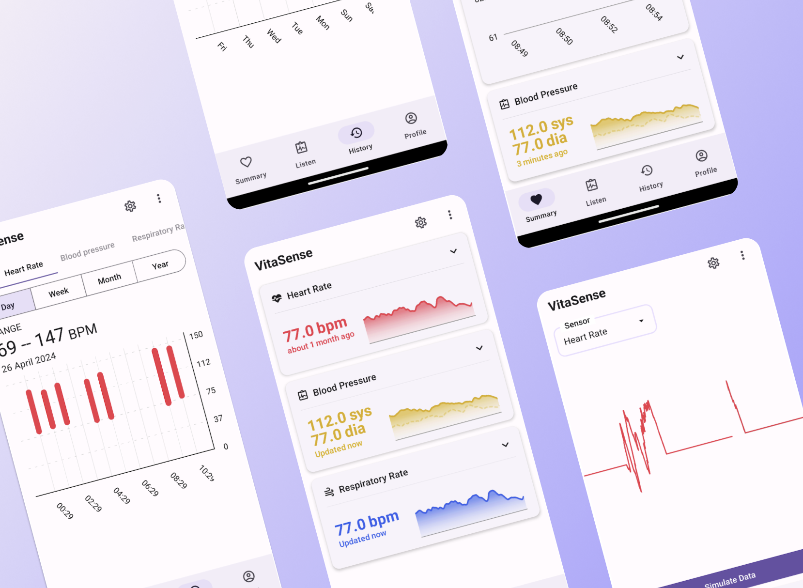
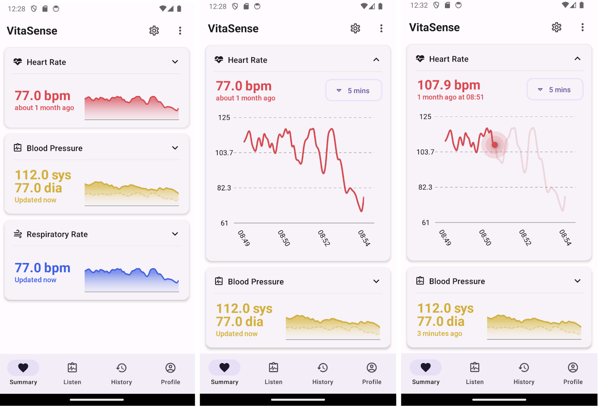
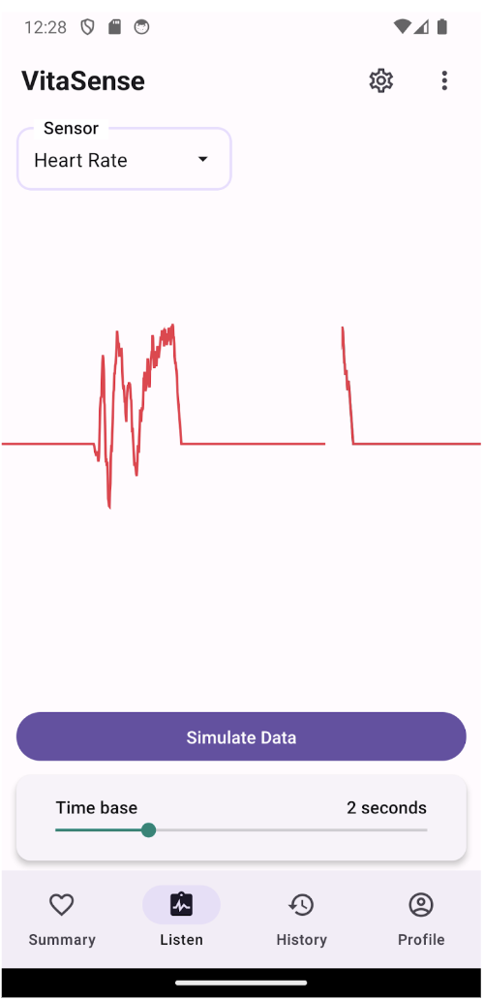
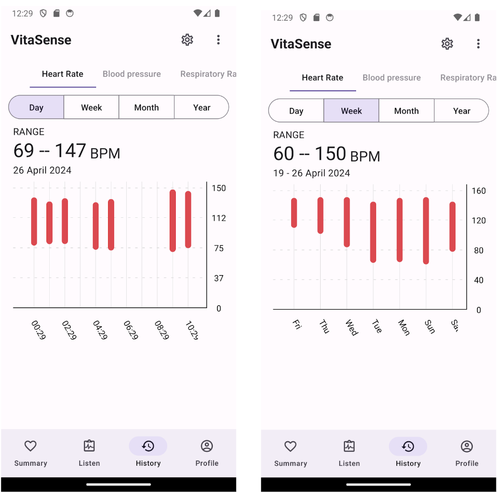

# VitaSense

## Health monitoring mobile application built with React Native



This project is part of EG2605 Undergraduate Research Opportunities Programme (UROP) undertaken during Year 2 Semester 2.

Features:

- View live raw sound data from sensors via Bluetooth Low Energy (BLE)
- Display processed data
  - Heart Rate
  - Blood Pressure
  - Respiratory Rate
- Store and view historic data
  - Stored as ranges and averages over different intervals

More detailed information can be found in the [report](report.pdf). Link to initial Figma design can be found [here](https://www.figma.com/proto/rscaqvvfQG3oc2lAk9ymbp/UROP-Project?node-id=0-1&t=D2Rvm3p4Alzlo0zG-1).

### Installation

Firstly, install the necessary packages to build the project via NPM

```
npm install
```

> Since this project requires **Bluetooth** to receive data, the Expo Go app cannot be used for development. Instead, you have to build the **native applications** for Android and iOS.

However, due to the need for the Apple Developer license to run on iOS, our primary target will be on **Android** devices for development.

#### Android

Install `Android NDK` via Android Studio for Skia to build natively using C++. Next, specify the android sdk path by creating a file named `local.properties` in the android folder and adding the following entry:

```
// Windows
sdk.dir = C://Users//USERNAME//AppData//Local//Android//Sdk

// MacOS
sdk.dir = /Users/USERNAME/Library/Android/sdk
```

Run the following commands in terminal to compile and run the development build to be run on Android deveices. Refer to [here](https://docs.expo.dev/guides/local-app-development/) for more information regarding compiling the application.

```
npx expo prebuild
npx expo run:android
```

Software versions to compile build:
| Software | Version |
| -------- | -------- |
| Java | 17 |
| Android SDK | 35 |
| Android SDK build tools | 35 |
| Android NDK | 25.1.8937393 |

Alternatively, you can run the development build which makes use of `expo-dev-client`. The application will run automatically after the build completes.

```
eas build --profile development --platform android --local
```

To run subsequent development builds, simply run:

```
npx expo start
```

## Features

### Summary overview

The summary page offers an overview of all the processed data obtained from the sensor. Currently, the application is able to show single value metrics (such as heart and respiratory rate) and double value metrics (like blood pressure).



Implementing the line graphs was achieved using [Skia](https://skia.org/), a 2D graphics engine which can render animations on a separate UI thread, distinct from the main JavaScript thread. The D3 library was used to process the data into a format conducive to Skia operations.

### View live data

The listen page offers medical personnel a comprehensive view of raw sound data measured by the sensor, presented in a cardiogram format.

 

In order to display incoming data at rate greater than the display refresh rate of 60 fps/hz, the function handling incoming values follows these steps:

1. Data received from Bluetooth is stored in an array buffer.
2. With each frame drawn approximately every 17 milliseconds (1/60 Hz), we calculate the number of pixels the pointer will cover in each frame rerender (17 ms).
3. In cases where the buffer contains multiple data points during a frame rerender, we evenly distribute the incoming data into groups. The number of groups corresponds to the number of pixels displayed in each rerender.
4. Subsequently, we compute the average value of each group and display the resulting value for each corresponding pixel.

### Historical data

This page functions as a repository for long-term data storage, drawing inspiration from Apple Health's interface. Data is presented using bars that represent the range of values observed during a specific interval.

 

Data is stored in the device's internal storage. To facilitate file storage operations within the internal storage of the device, the Expo File System library is used.
